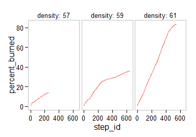

[](https://travis-ci.org/bergant/nlexperiment)

# __nlexperiment__

Provides functions to 
define __NetLogo__<sup>[1](#fn1)</sup> __experiments__ with parameter sets, measures and 
related simulation options in __concise__ structure. 
The cycle of experiment definition, simulations, data analysis, visualisations and
parameter fitting can be easily turned 
into __readable__ and __reproducible__ documents.
It uses __RNetLogo__<sup>[2](#fn2)</sup> as an interface to NetLogo environment.


## Documentation and Examples
See __[project website](http://bergant.github.io/nlexperiment/)__ for more information
or go through __[examples](http://bergant.github.io/nlexperiment/tutorial.html)__ to 
learn how to create experiments.


## Installation


```r
install.packages("RNetLogo")
devtools::install_github("bergant/nlexperiment")
```

## Example
Simple experiment with NetLogo Fire model:<sup>[3](#fn3)</sup>


```r
library(nlexperiment)
nl_netlogo_path("c:/Program Files (x86)/NetLogo 5.2.0") 
```

Define the experiment:

```r
experiment <- nl_experiment(
  model_file = "models/Sample Models/Earth Science/Fire.nlogo", 
  while_condition = "any? turtles",
  param_values = list(density = c(57, 59, 61)),
  random_seed = 1,
  step_measures = measures(
    percent_burned = "(burned-trees / initial-trees) * 100"
  )
)
```

Run the experiment:


```r
result <- nl_run(experiment)  
```

Plot the results:

```r
nl_show_step(result, x = "step_id", y = "percent_burned", x_param = "density")
```

 


See more [examples](http://bergant.github.io/nlexperiment/tutorial.html) 
on the [project website](http://bergant.github.io/nlexperiment/).

---

<a name="fn1">1</a>: Wilensky, U. (1999). NetLogo. http://ccl.northwestern.edu/netlogo/. Center for Connected Learning and Computer-Based Modeling, Northwestern University, Evanston, IL.

<a name="fn2">2</a>: Jan C. Thiele (2014). R Marries NetLogo: Introduction to the RNetLogo Package. Journal
of Statistical Software, 58(2), 1-41. URL http://www.jstatsoft.org/v58/i02/.

<a name="fn3">3</a>: Wilensky, U. (1997). 
NetLogo Fire model. http://ccl.northwestern.edu/netlogo/models/Fire. 
Center for Connected Learning and Computer-Based Modeling, 
Northwestern University, Evanston, IL.

