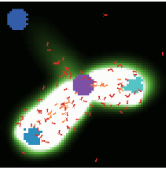
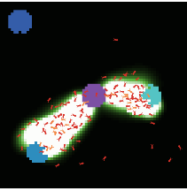
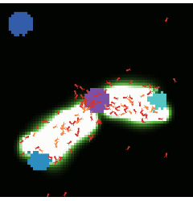
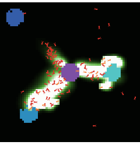
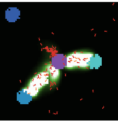

# nlexperiment
Define and run controlled NetLogo experiments
  analogous to NetLogo BehaviorSpace.

## Installation

```r
library(devtools)
install_github("bergant/nlexperiment")
```


## Simple experiment with fire
Create NetLogo experiment object

```r
library(nlexperiment)
# Set the path to your NetLogo instalation
nl_netlogo_path("c:/Program Files (x86)/NetLogo 5.1.0/") 
# Fire model is included in NetLogo sample models:
fire_model <- file.path(nl_netlogo_path(), "models/Sample Models/Earth Science/Fire.nlogo")

# Create simple NetLogo experiment object
experiment <- nl_experiment(
  model_file = fire_model, 
  while_condition = "any? turtles",
  repetitions = 3,
  export_view = TRUE
)
```

Run the experiment:

```r
result <- nl_run(experiment)
#> Warning: No parameter space defined. Using default parameters
```

Find exported view image files paths in `result$export` or just display them by calling `nl_show_view` function:

```r
nl_show_view(result)
```

   


## Observations per each simulation step
Create NetLogo experiment object with step measure defined:

```r
experiment <- nl_experiment(
  model_file = fire_model, 
  while_condition = "any? turtles",
  repetitions = 3,
  step_measures = measures(
    percent_burned = "(burned-trees / initial-trees) * 100"
  )
)
```

Run the experiment:

```r
result <- nl_run(experiment)
#> Warning: No parameter space defined. Using default parameters
```

Observe how fire advances in time for different model runs:

```r
library(ggplot2)

ggplot(result$step, mapping = aes(x = tick, y=percent_burned) ) + 
  geom_point(size = 0.5) +
  facet_grid(. ~ run_id)
```

 

Note that `run_id` and `tick` values are included in the `results$step` by default.


## Observations per each simulation run
Create NetLogo experiment object with defined *run* measure (percent burned)
and parameter values - parameter density goes from `55` to `62` and repeat
simulation `30` times for every parameter:

```r
experiment <- nl_experiment(
  model_file = fire_model, 
  while_condition = "any? turtles",
  repetitions = 30,
  run_measures = measures(
    percent_burned = "(burned-trees / initial-trees) * 100",
    progress = "max [pxcor] of patches with [pcolor > 0 and pcolor < 55]"
  ),
  param_values = list(
    density = seq(from = 55, to = 62, by = 1)
  )
)
```

Running the experiment with `parallel` option will run
simulations with several working processes on multi-core processors.
It can save some time with large parameter space and/or simulation repetitions:

```r
result <- nl_run(experiment, parallel = TRUE)
# Join observations with parameter space values:
dat <- nl_get_run_result(result, add_parameters = TRUE)
```

Plot the results - percent burned as a function of density:

```r
library(ggplot2)
# plot percent burned by density
ggplot(dat, mapping = aes(x = factor(density), y = percent_burned) ) + 
  geom_violin() +
  geom_jitter(position = position_jitter(width = .1), alpha = 0.3) 
```

 

Fire progress from left (-125) to right (125) as a function of density:

```r
ggplot(dat, mapping = aes(x = factor(density), y = progress) ) + 
  geom_jitter(position = position_jitter(width = .1), alpha = 0.3)  +
  theme_minimal()
```

 


## Parameter space
When parameter space is defined by list of values, it is interpreted as 
all possible combinations of parameters:

```r
experiment <- nl_experiment(
  model_file = fire_model, 
  while_condition = "any? turtles",
  repetitions = 30,
  run_measures = measures(
    percent_burned = "(burned-trees / initial-trees) * 100",
    progress = "max [pxcor] of patches with [pcolor > 0 and pcolor < 55]"
  ),
  param_values = list(
    world_size = c(100, 250),
    density = seq(from = 56, to = 61)
  )
)

experiment$param_space
#>    world_size density
#> 1         100      56
#> 2         250      56
#> 3         100      57
#> 4         250      57
#> 5         100      58
#> 6         250      58
#> 7         100      59
#> 8         250      59
#> 9         100      60
#> 10        250      60
#> 11        100      61
#> 12        250      61
```


*Note: `world_size` is a special parameter name. Instead of setting NetLogo variable 
it changes the NetLogo world dimensions.*

Sometimes we do not want to run the model for all combinations of parameter values
(often because all combinations might produce a huge parameter space). 
In this case use **data frame instead of a list** in `nl_experiment` or 
`nl_set_param_space` function to set parameter values. 
Here is an example of parameter space with different density values and
two world sizes where only some of the density values are used for the big sized world:


```r
experiment <- nl_set_param_space( experiment,
  param_values = rbind(
    expand.grid(
      world_size = 100,
      density = seq(from = 56, to = 61)
    ),
    expand.grid(
      world_size = 250,
      density = c(58, 59, 60) # only 3 densities for the big world
    )
  )
)

experiment$param_space
#>   world_size density
#> 1        100      56
#> 2        100      57
#> 3        100      58
#> 4        100      59
#> 5        100      60
#> 6        100      61
#> 7        250      58
#> 8        250      59
#> 9        250      60
```


Run the experiment with the `parallel` attribute:

```r
result <- nl_run(experiment, parallel = TRUE)
# Join observations with parameter space values:
dat <- nl_get_run_result(result, add_parameters = TRUE)
```

Plot the results - with world size as facets:

```r
ggplot(dat, mapping = aes(x = factor(density), y=percent_burned, 
                          color = factor(density %in% c(58, 59, 60)))) + 
  geom_boxplot(outlier.shape=NA) +
  geom_jitter(position = position_jitter(width = .1), alpha = 0.3) +
  facet_grid(. ~ world_size, scales = "free_x", space = "free_x") +
  theme(legend.position="none") +
  scale_color_manual(values = c("gray", "black")) +
  ggtitle("Percent burned as a function of density and world size") +
  xlab("Forest density") +
  ylab("Percent burned")
```

 


## Mapping parameters
NetLogo identifiers may include any of the following ASCII characters:

`.?=*!<>:#+/%$_^'&-`

which are awkward to use in R data manipulation. 
To map R variables to NetLogo parameters use `mapping` option:


```r
experiment <- nl_experiment(
  model_file = file.path(nl_netlogo_path(), 
                         "models/Sample Models/Biology/Ants.nlogo"), 
  while_condition = "ticks < 150",
  step_measures = measures(
    pile1 = "sum [food] of patches with [pcolor = cyan]",  
    pile2 = "sum [food] of patches with [pcolor = sky]",  
    pile3 = "sum [food] of patches with [pcolor = blue]"  
  ),
  param_values = list(
    population = 125,
    diffusion_rate = c(50, 60),
    evaporation_rate = c(5, 10, 15)
  ),
  random_seed = 1,
  mapping = c(
    diffusion_rate = "diffusion-rate",
    evaporation_rate = "evaporation-rate"
    ),
  export_view = TRUE
)

experiment$param_space
#>   population diffusion_rate evaporation_rate
#> 1        125             50                5
#> 2        125             60                5
#> 3        125             50               10
#> 4        125             60               10
#> 5        125             50               15
#> 6        125             60               15
```

Run experiment

```r
results <- nl_run(experiment)
```

Show views

```r
results <- nl_run(experiment)
nl_show_view(results)
```

      

Show remaining food by parameter space and food pathces

```r
library(tidyr)
dat <- nl_get_step_result(results)
dat <- tidyr::gather(dat, pile, value, pile1, pile2, pile3)
ggplot(dat, aes(x = tick, y = value, color = pile) ) +
  geom_line() +
  facet_grid(diffusion_rate ~ evaporation_rate, margins = c(2,3))
```

 


