[](https://travis-ci.org/bergant/nlexperiment)

----
<a name="nlexperiment"></a>


####Define and run NetLogo experiments in R

The goal of **nlexperiment** is to make 
exploring NetLogo models with R as simple as possible 
while keeping advanced functionalities available to
advanced users.
It uses [RNetLogo](https://cran.r-project.org/web/packages/RNetLogo/)
package (Thiele 2014) as an interface to NetLogo.


## Installation

`library(devtools)`   
`install_github("bergant/nlexperiment")`


## Simple experiment with fire
This sample experiment with NetLogo Fire model (Wilensky 1997) demonstrates
how to create and run minimal experiment. It runs the model with three parameter
values (forest density) and exports final NetLogo views to image files:


```r
library(nlexperiment)
# Set the path to your NetLogo instalation
nl_netlogo_path("c:/Program Files (x86)/NetLogo 5.2.0/") 

# Create NetLogo experiment object
experiment <- nl_experiment(
  model_file = file.path(nl_netlogo_path(), 
                         "models/Sample Models/Earth Science/Fire.nlogo"), 
  while_condition = "any? turtles",
  param_values = list(density = c(57, 59, 61)),
  random_seed = 1,
  export_view = TRUE
)
```

Run the experiment:

```r
result <- nl_run(experiment)     
```

Find paths to the exported view image files in `result$export` or just display them by calling `nl_show_views_grid` function:


```r
library(ggplot2)
nl_show_views_grid(result, "density")
```

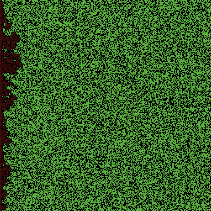 


## Temporal measures
Set measures for each simulation step:

```r
experiment <- nl_experiment(
  model_file = file.path(nl_netlogo_path(), 
                         "models/Sample Models/Earth Science/Fire.nlogo"), 
  while_condition = "any? turtles",
  param_values = list(density = c(57, 59, 61)),
  random_seed = 1,
  step_measures = measures(
    percent_burned = "(burned-trees / initial-trees) * 100"
  )
)
```

Run the experiment:

```r
result <- nl_run(experiment)
```

To analyse the results from observations 
use `nl_get_step_result`:


```r
# get the observation data for step measures
dat <- nl_get_step_result(result)
head(dat)
#>   density param_set_id percent_burned step_id run_id
#> 1      57            1      0.4030340       1      1
#> 2      57            1      0.6437348       2      1
#> 3      57            1      0.8788379       3      1
#> 4      57            1      1.0859526       4      1
#> 5      57            1      1.3070615       5      1
#> 6      57            1      1.5113773       6      1
```

Or use `nl_show_step` to plot 
observations based on temporal measures:


```r
# get the observation data for step measures
nl_show_step(result, x_param = "density")
```

 


*Note: values `run_id` and `step_id` are included in the `result$step` by default.
Parameter values are included only by reference to `parameter_set_id`. The 
function `nl_get_result` joins parameter sets to observation data.*


## Observations per each simulation run
In this example

* two measures _per simulation run_ are defined (values are reported at the end 
of each simulation run),
* the model will be run repetedly `30` times for every parameter value
* the model is running with `parallel` option (to save some time)


```r
experiment <- nl_experiment(
  model_file = file.path(nl_netlogo_path(), 
                         "models/Sample Models/Earth Science/Fire.nlogo"), 
  while_condition = "any? turtles",
  repetitions = 30,
  run_measures = measures(
    percent_burned = "(burned-trees / initial-trees) * 100",
    progress = "max [pxcor] of patches with [pcolor > 0 and pcolor < 55]"
  ),
  param_values = list(
    density = seq(from = 55, to = 62, by = 1)
  )
)
```

Run the experiment with `parallel` option:

```r
result <- nl_run(experiment, parallel = TRUE)
```

Join observations with parameter set values:

```r
dat <- nl_get_run_result(result)
```

Plot the results - percent burned as a function of density:

```r
library(ggplot2)
ggplot(dat, mapping = aes(x = factor(density), y = percent_burned) ) + 
  geom_violin(fill = "gray90") +
  labs(x = "Forest density", y = "Percent burned") + 
  theme_minimal()
```

 

Fire advances from left to right. It is interesting to observe
final fire position (left border = 0 and right = 1) as a function of density.

```r
ggplot(dat, mapping = aes(x = factor(density), y = progress/250 + 0.5) ) + 
  geom_jitter(position = position_jitter(width = .1), alpha = 0.3)  +
  labs(x = "Forest density", y = "Fire progress") +
  theme_minimal()
```

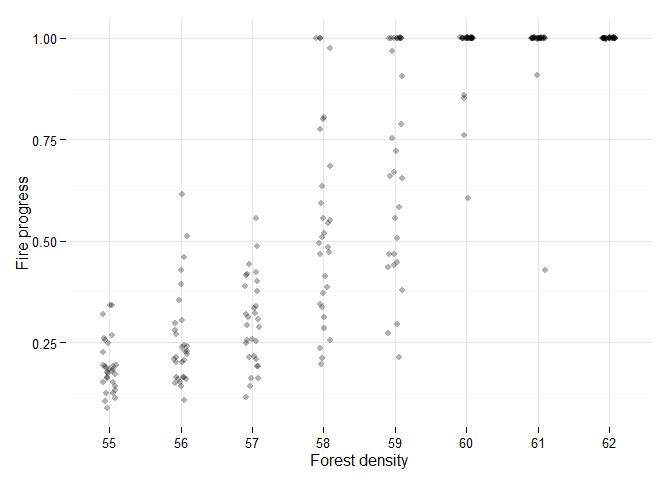 


## Reading agent variables
While `run_measures` 
(see [Observations per each simulation run](#observations-per-each-simulation-run)) 
is good enough for aggregate measures, sometimes we need values for each agent individually.
Example shows usage of `agents_after` parameter to get vertices from Preferential attachment
model.


```r
experiment <- nl_experiment(
  model_file = file.path(nl_netlogo_path(), 
                         "models/Sample models/Networks/Preferential attachment.nlogo"), 
  iterations = 50,
  agents_after = list(
    vertices = agent_set(
      vars = c("who", "xcor", "ycor"), 
      agents = "turtles"),
    edges = agent_set(
      vars = c(e1 = "[who] of end1", e2 ="[who] of end2"), 
      agents = "links")
  ),
  repetitions = 2,
  random_seed = c(42, 69)
)
```

_Note:_

* _Here random seed is defined as a vector. It is applied to each repetition respectively._
* _Variables in agent set may or may not include variable names._
* _Element `agents_before` is analogous tp `agents_after` - it just gets the data before model runs.)_

Run experiment

```r
result <- nl_run(experiment)
#> Warning: Parameter sets not defined. Using default parameters
```

Show graph by using **igraph** package:


```r
library(igraph, quietly = TRUE, warn.conflicts = FALSE)
par(mfrow=c(1,2), mai=c(0,0,0,0))
for(i in 1:experiment$run_options$repetitions) {
  g_edges <- subset(result$agents_after$edges, run_id == i)
  g1 <- graph.data.frame(g_edges, directed = FALSE)
  V(g1)$size <- sqrt(degree(g1))*6
  V(g1)$label <- ifelse(as.numeric(V(g1)$name) < 4, as.numeric(V(g1)$name), NA)
  plot.igraph(g1, margin = 0, 
              vertex.label.font = V(g1)$size * 0.07,
              vertex.label.color = "white",
              vertex.color="darkseagreen4",
              edge.color = "gray",
              vertex.frame.color="#ffffff",
              edge.curved=.1
  )
}
```

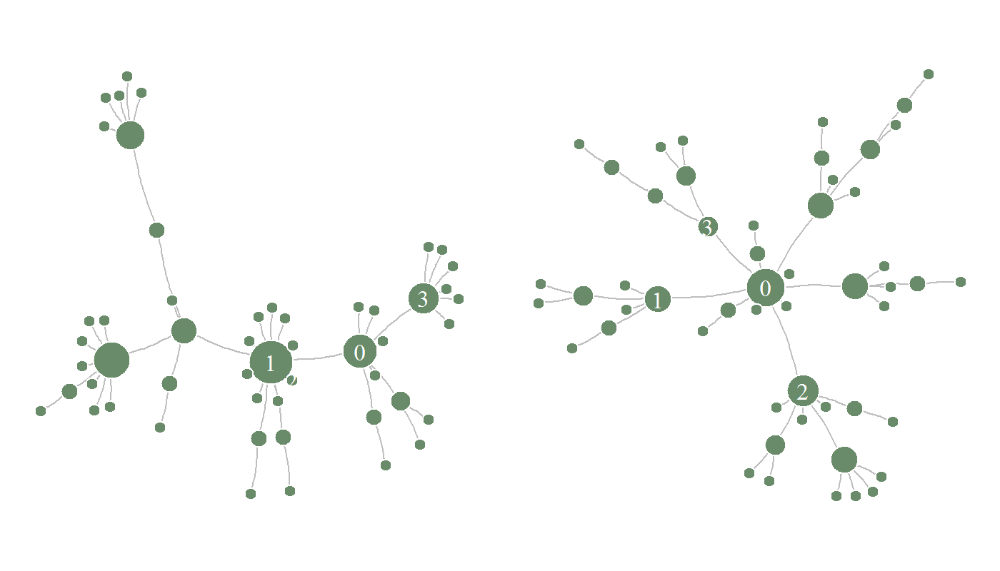 

_Note:_

* _Data frame `result$agents_after$edges` includes variables from all simulation runs._
* _Use `param_space_id` and/or `run_id` columns to subset individual run or parameter combination_


## Reading patches
Getting patches information is analogous to reading agents' data from NetLogo model:


```r
experiment2 <- nl_experiment( 
  model_file = file.path(nl_netlogo_path(), 
                         "models/Sample Models/Biology/Fur.nlogo"), 
  iterations = 20,                                     
  
  param_values = list(
    ratio = c(0.3, 0.35, 0.4, 0.45)
  ),
  patches_after = list(
    patches = patch_set(
      vars = c("pxcor", "pycor", "pcolor"),
      patches = "patches"
    )
  ),
  random_seed = 2
)

result2 <- nl_run(experiment2)

nl_show_patches(result2, x_param = "ratio") +
  ggplot2::scale_fill_manual(values = c("black","white"))
```

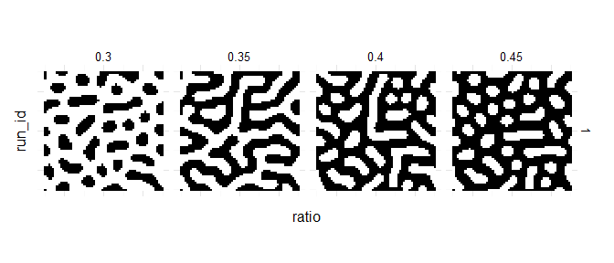 


## Simple parameter sets definition
The following example is using Ant model (Wilensky 1997) to show 
simple parameter sets definition and parameter mapping.


```r
experiment <- nl_experiment(
  model_file = file.path(nl_netlogo_path(), 
                         "models/Sample Models/Biology/Ants.nlogo"), 
  iterations = 150,
  step_measures = measures(
    pile1 = "sum [food] of patches with [pcolor = cyan]",  
    pile2 = "sum [food] of patches with [pcolor = sky]",  
    pile3 = "sum [food] of patches with [pcolor = blue]"  
  ),
  param_values = list(
    population = 125,
    diffusion_rate = c(50, 70),
    evaporation_rate = c(5, 10, 15)
  ),
  mapping = c(
    diffusion_rate = "diffusion-rate",
    evaporation_rate = "evaporation-rate"
    ),
  random_seed = 2,
  export_view = TRUE
)
```

_Note:_

* _When parameters are defined as a list of value vecors, parameter sets are
  constructed as combination of all possible parameter value combination_
* _It is not required to include all parameters in mapping. Variable `population` 
is used as is._
* _Element `mapping` maps `difussion_rate` and `evaporation_rate` names to NetLogo variables `diffusion-rate` and `evaporation-rate`._


Run experiment

```r
results <- nl_run(experiment)    
```

Show views

```r
nl_show_views_grid(results, 
                   x_param = "evaporation_rate", 
                   y_param = "diffusion_rate")
```

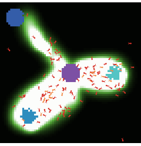 

Show remaining food by difussion rate and evaporation rate for all food piles

```r

library(tidyr)
dat <- nl_get_step_result(results)
dat <- tidyr::gather(dat, pile, value, pile1, pile2, pile3)

library(ggplot2)
ggplot(dat, aes(x = step_id, y = value, color = pile) ) +
  geom_line() +
  facet_grid(diffusion_rate ~ evaporation_rate) +
  theme_minimal()
```

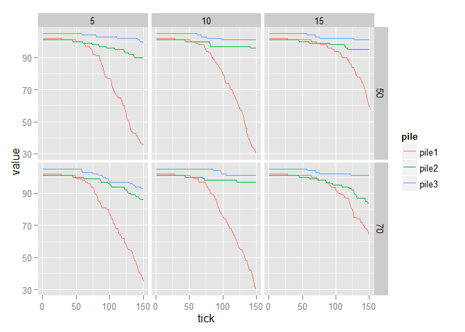 


## Parameter space mapping
The following example is using NetLogo Fur model (Wilensky 2003) to show 
explicit definition of parameter sets and parameter mapping.

There are 5 parameters in the NetLogo Fur model: 

* `ratio` 
* `outer-radius-y`
* `inner-radius-y`
* `outer-radius-x`
* `inner-radius-x`

But considering constraints and model symmetry
we can reduce the parameters to:

* `ratio` (the inhibitor concentration parameter)
* `radius_diff` (the difference between x and y radius) and
* `gap` (distance between inner and outer ellipse)

(for simplicity let's keep the `gap` between the circles constant):


```r
experiment <- nl_experiment( 
  model_file = file.path(nl_netlogo_path(), 
                         "models/Sample Models/Biology/Fur.nlogo"), 
  iterations = 20,                                     

  param_values = {                                  # Parameter sets:
    param_sets <- expand.grid(                      #   all combinations of
        gap = 3,                                    #   gap, ratio and ry- rx
        radius_diff = seq(0, 2, by = 0.5), 
        ratio = seq(0.30, 0.65, by = 0.05)
    )
    transform(param_sets,                           # Transform to NetLogo
      inner_radius_x = 3,                           #   variables
      outer_radius_x = 3 + gap,
      inner_radius_y = 3 + radius_diff,
      outer_radius_y = 3 + radius_diff + gap
    )
  },
  mapping = c(
    gap = "",
    radius_diff = "",
    inner_radius_x = "inner-radius-x",
    outer_radius_x = "outer-radius-x",
    inner_radius_y = "inner-radius-y",
    outer_radius_y = "outer-radius-y"
  ),
  patches_after = list(
    patches = patch_set(
      vars = c("pxcor", "pycor", "pcolor"),
      patches = "patches"
    )
  ),  
  random_seed = 3
)
```

_Note:_ 

* _Element `param_values` is set by a data frame with explicit parameter sets_ 
* _Variables `gap` and `radius_diff` must be mapped to empty string (not NetLogo variables)._


Run experiment

```r
result <- nl_run(experiment, parallel = TRUE, max_cores = 3)    
```

Show resulting fur patterns:

```r
library(ggplot2)
nl_show_patches(result, x_param = "ratio", y_param = "radius_diff") + 
  scale_fill_manual(values = c("black","white")) +
  labs(y=expression(radius[y] - radius[x]), title = "Fur patterns (gap = 3)")
```

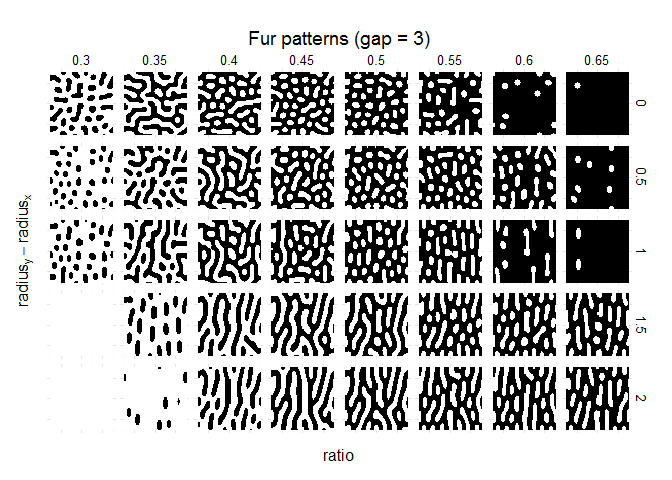 


## Flocking example - Temporal (step) measures

This sample experiment is using NetLogo Flocking model (Wilensky, 1998).
Two measures of self-organization are defined:

* __converergence__ is based on variance of birds' orientations (Stonedahl, 2011)
* __mean crowding__ is average group size as experienced by individual (Reiczigel et al., 2008)

Define experiment with `nl_experiment` function:


```r
experiment <- nl_experiment( 
  model_file = 
    file.path(nl_netlogo_path(), "models/Sample Models/Biology/Flocking.nlogo"),
  setup_commands = 
    c("setup", "repeat 10 [go]"),
  iterations = 100,

  param_values = list(
    world_size = 50,
    population = 100,
    vision = c(2,6)
  ),

  step_measures = measures(
    converged = "1 - 
      (standard-deviation [dx] of turtles + 
       standard-deviation [dy] of turtles) / 2",
    mean_crowding = 
      "mean [count flockmates + 1] of turtles"
  ),
  repetitions = 2,
  random_seed = c(1, 4),
  export_view = TRUE
)
```

Run experiment


```r
result <- nl_run(experiment)       
```

Plot results


```r
# get observation of step measures
library(ggplot2) 
nl_show_views_grid(result, x_param = "vision", y_param = "run_id", img_gap = 0.01) +
  labs(title = "Simulation views")
nl_show_step(
  result, y =  "converged", x_param = "vision",  title = "Convergence")
nl_show_step(
  result, x = "mean_crowding", y =  "converged", 
  x_param = "vision", y_param = "run_id", title = "Two measures plot")
nl_show_step(
  result, y =  "mean_crowding", x_param = "vision", title = "Mean crowding")
```

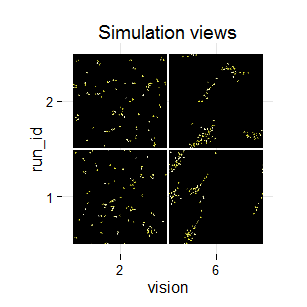 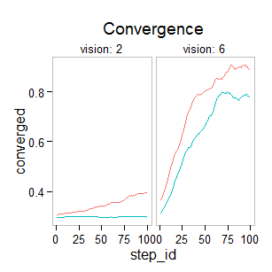 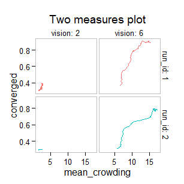 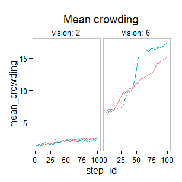 


## Visualize temporal measures on parameter space 
It is obvious from the plots above that initial (random) positions influence the 
resulting measures. Below is an attempt to find the values 
for *min_separation* and *max_align_turn* parameters 
with best convergence:


```r
experiment <- nl_experiment( 
  model_file = 
    file.path(nl_netlogo_path(), "models/Sample Models/Biology/Flocking.nlogo"),
  setup_commands = c("setup", "repeat 10 [go]"),
  #go_command = c("repeat 5 [go]"),
  iterations = 50,

  param_values = list(
    world_size = 50,
    population = 100,
    min_separation = seq(from = 0, to = 3, by = 1),
    max_align_turn = c(10, 15, 20)
  ),
  mapping = c(
    min_separation = "minimum-separation",
    max_align_turn = "max-align-turn"),

  step_measures = measures(
    converged = "1 - 
      (standard-deviation [dx] of turtles + 
       standard-deviation [dy] of turtles) / 2"
  ),
  repetitions = 30, 
  random_seed = 1:30
)
```

Run experiment:

```r
result2 <- nl_run(experiment, parallel = TRUE)   
```

Plot temporal measure with 2 varying parameters:

```r
library(ggplot2)
nl_show_step(result2, y_param = "max_align_turn", x_param = "min_separation",
                  color = NA,  alpha = 0.3)
```

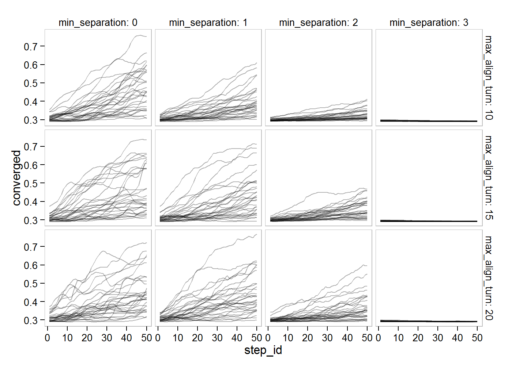 

## Searching parameter space - categorical criteria

Create experiment with evaluation criteria:

```r
experiment <- nl_experiment( 
  model_file = 
    file.path(nl_netlogo_path(), "models/Sample Models/Biology/Flocking.nlogo"),
  setup_commands = c("setup", "repeat 100 [go]"),
  iterations = 5,

  param_values = list(
    world_size = 50,
    population = 80,
    vision = c(3,6),
    min_separation = seq(from = 0, to = 4, by = 0.5),
    max_align_turn = seq(from = 0, to = 20, by = 2.5)
  ),
  mapping = c(
    min_separation = "minimum-separation",
    max_align_turn = "max-align-turn"),

  step_measures = measures(
    converged = "1 - 
      (standard-deviation [dx] of turtles + 
       standard-deviation [dy] of turtles) / 2",
    mean_crowding = 
      "mean [count flockmates + 1] of turtles"
  ),
  eval_criteria = criteria(
    c_converged = mean(step$converged),
    c_mcrowding = mean(step$mean_crowding)
  ),

  repetitions = 10,                              # repeat simulations 10 times
  random_seed = 1:10,
  
  eval_aggregate_fun = mean                     # aggregate over repetitions
)
```

_Note:_

* _Parameter sets are defined with values for each parameter which
  is interpreted as full factorial design (all parameter values combination)_
* _Criteria expression uses the result from step measures (`step$` prefix)_
* _Aggregate function (`eval_aggregate_fun`) specifies that the results
   from criteria function should be aggregated 
   (over all 10 repetitions for each parameter set)_

Run the experiment:

```r
result3 <- nl_run(experiment, parallel = TRUE) 
```

If we were interested in parameters where we get small sized flocks 
which fly in same direction
we could define criteria based on crowding and direction convergence
like this:


```r
dat <- nl_get_criteria_result( 
  result3,
  are_grouped = c_mcrowding >= 5 & c_mcrowding < 11,
  are_aligned = c_converged > 0.7
)

ggplot( dat, aes(x = min_separation, y = max_align_turn) ) +
  geom_point() +
  geom_point(data = subset(dat, are_aligned), color = "red", size = 5, shape = 2) +
  geom_point(data = subset(dat, are_grouped), color = "blue", size = 5, shape = 3) +
  coord_equal(ratio = 1/5) +
  facet_grid(. ~ vision, labeller = label_both) +
  theme_minimal() +
  theme(panel.margin = grid::unit(0.07,"npc"))
```

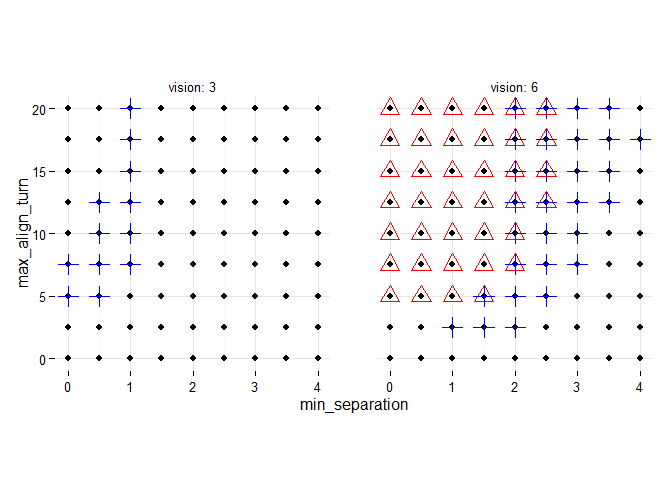 


## Categorical evaluation with LHS sampling
Instead of exploring parameter space with (full) factorial design we can use sampling methods. Below is an example with latin hypercube sampling from tgp package:


```r
# use Latin Hypercube sampling to sample 50 parameter sets
library(tgp)

experiment <- nl_set_param_values( experiment,
  param_values = nl_param_lhs(
    n = 100, 
    world_size = 50,
    population = 80,
    vision = c(6),
    min_separation = c(0, 4),
    max_align_turn = c(0, 20)
  )
)
```

_Note:_

* _To change only parameter sets use `nl_set_param_values`. The rest of
  experiment definition is not changed. If new parameters are added
  set the mapping accordingly.
* _Function `nl_param_lhs` is using `lhs` from **tgp** package to create
  random parameter sets_
* _Instead of using `nl_param_lhs` one can put any data frame in param_values.
  The columns of a data frame are interpreted as parameter names and rows should
  represent parameter sets._


```r
result4 <- nl_run(experiment, parallel = TRUE)
```


Add categorical criteria:

```r
dat <- nl_get_criteria_result( 
  result4,
  are_grouped = c_mcrowding >= 5 & c_mcrowding < 11,
  are_aligned = c_converged > 0.7
)

ggplot( dat, aes(x = min_separation, y = max_align_turn) ) +
  geom_point() +
  geom_point(data = subset(dat, are_aligned), color = "red", size = 5, shape = 2) +
  geom_point(data = subset(dat, are_grouped), color = "blue", size = 5, shape = 3) +
  coord_equal(ratio = 1/5) +
  theme_minimal()
```

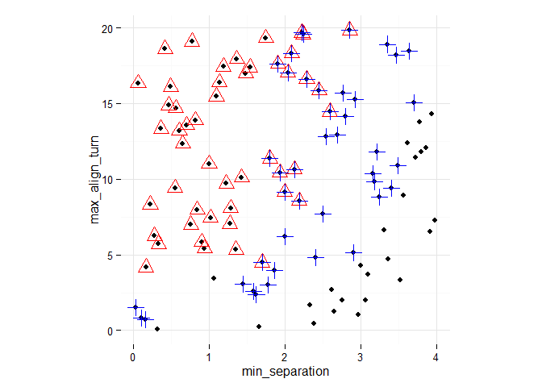 

## Best-fit criterion

Create full factor design parameter sets:

```r
experiment <- nl_set_param_values( experiment,
  param_values = list(
    world_size = 50,
    population = 80,
    vision = c(6),
    min_separation = seq(from = 0, to = 4, by = 0.25),
    max_align_turn = seq(from = 0, to = 20, by = 1.25)
  )
)
```

Run experiment:

```r
result5 <- nl_run(experiment, parallel = TRUE)
```

Calculate single evaulation criterion (ideally mean crowding is around 8
and convergence is near 1):


```r
dat <- nl_get_criteria_result( 
  result5,
  eval_value = pmin(10, sqrt((c_mcrowding - 8)^2 + 100*(c_converged - 1)^2))
)
```


Plot the result:

```r
ggplot( dat, aes(x = min_separation, y = max_align_turn, fill = eval_value) ) +
  geom_tile() + coord_fixed(4/20) + theme_minimal() +
  theme(legend.position="none")

ggplot( dat, aes(x = min_separation, y = max_align_turn, z = eval_value) ) +
  stat_contour(bins =11, aes(color = ..level..)) +
  coord_fixed(4/20) + theme_minimal() + theme(legend.position="none")
```

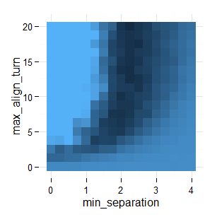 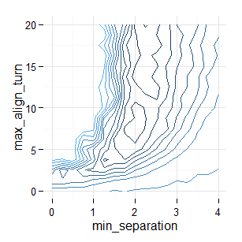 

## Parameter fitting and optimization with L-BFGS-B
Optimization methods can't benefit from pre-defined parameter sets. Parameter 
values are selected as optimization runs. 
In this scenario the `nl_eval_run` function should be used instead of `nl_run`. 

There are two differences between `nl_eval_run` and `nl_run`:

* `nl_run_eval` accepts a single parameter set and returns a numeric value 
* It requires started NetLogo instance - user have to take care to 
  initialize NetLogo and load the model before optimization begins and 
  close NetLogo when it is no longer needed 
  (see `nl_eval_init` and `nl_eval_close` in package documentation).

Use `nl_eval_run` _parallel_ option when optimizing stochastic models
with more than a few repetitions needed to evaluate one parameter set. 

There are many R packages for solving optimization problems 
(see [CRAN Task View](https://cran.r-project.org/web/views/Optimization.html)).
This example use **L-BFGS-B method** with standard `stats::optim` function.
See also Thiele, Kurth & Grimm (2014) chapter 
[2.28 Gradient and quasi-Newton methods](http://jasss.soc.surrey.ac.uk/17/3/11.html#sectionGQNM).

Define experiment: 


```r
experiment <- nl_experiment( 
  model_file = 
    file.path(nl_netlogo_path(), "models/Sample Models/Biology/Flocking.nlogo"),
  setup_commands = c("setup", "repeat 100 [go]"),
  iterations = 5,

  param_values = list(
    world_size = 50,
    population = 80,
    vision = 6,
    min_separation = seq(from = 0, to = 4, by = 0.5),
    max_align_turn = seq(from = 0, to = 20, by = 2.5)
  ),
  mapping = c(
    min_separation = "minimum-separation",
    max_align_turn = "max-align-turn"),

  step_measures = measures(
    converged = "1 - 
      (standard-deviation [dx] of turtles + 
       standard-deviation [dy] of turtles) / 2",
    mean_crowding = 
      "mean [count flockmates + 1] of turtles"
  ),
  eval_criteria = criteria(
    c_converged = mean(step$converged),
    c_mcrowding = mean(step$mean_crowding)
  ),

  repetitions = 10,                              # repeat simulations 10 times

  eval_aggregate_fun = mean,                     # aggregate over repetitions

  eval_mutate = criteria(                        # avaluation criterium
    eval_value = 
      sqrt((c_mcrowding - 8)^2 + 100*(c_converged - 1)^2)
  )
)
```


```r
 
# initialize evaluation 
cl <- nl_eval_init(experiment, parallel = TRUE)
#> [1] "Creating sockets..."

# create callback container to spy what the optim function is doing
trace <- nl_eval_tracer(verbose = FALSE)

#get parameters' range (used for bounds on the variables for the "L-BFGS-B" method)
param_range <- nl_get_param_range(experiment)   

#call optimisation function with L-BFGS-B method:
set.seed(1) 
o_result <- optim(
  #par = param_range$upper,  
  par = (param_range$upper + param_range$lower)/2,
  nl_eval_run, 
    experiment = experiment, criteria = "eval_value", 
    call_back = trace$add, parallel = TRUE, cluster = cl,
  method = "L-BFGS-B",
  lower = param_range$lower, upper = param_range$upper, 
  control = list(maxit = 200, trace = 1))
#> final  value 2.877086 
#> converged

nl_eval_close(parallel = TRUE, cl)
o_result
#> $par
#> min_separation max_align_turn 
#>       2.167263      10.836315 
#> 
#> $value
#> [1] 2.877086
#> 
#> $counts
#> function gradient 
#>        9        9 
#> 
#> $convergence
#> [1] 0
#> 
#> $message
#> [1] "CONVERGENCE: REL_REDUCTION_OF_F <= FACTR*EPSMCH"
```

The `trace$add` function colected every iteration of `optim`. 


```r
tr <- trace$get()

library(ggplot2)
ggplot(tr, aes(x = iter_id,  y = result)) +
  geom_line() +
  theme_minimal()
```

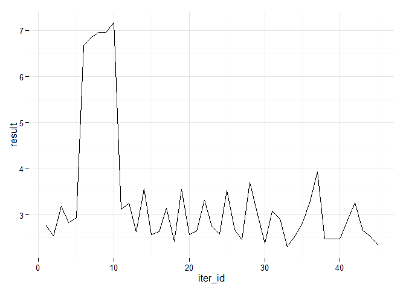 


Where did `optim` look for best value?


```r

ggplot(tr, aes(x = min_separation,  y = max_align_turn)) +
  geom_path(alpha = 0.1)+
  geom_point(shape = 4, size = 5, alpha = 0.3) +
  scale_x_continuous(limits = c(0, 4)) +
  scale_y_continuous(limits = c(0, 20)) +
  theme_minimal()
```

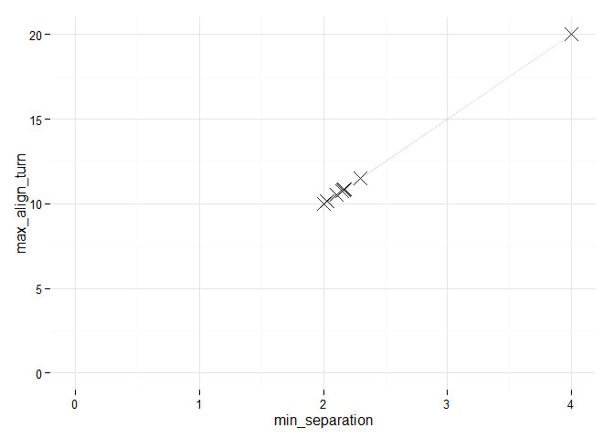 


## References


* Thiele, J. (2014) R Marries NetLogo: Introduction to the RNetLogo Package. Journal of Statistical Software 58(2) 1-41. http://www.jstatsoft.org/v58/i02/

* Railsback, S. F., & Grimm, V. (2011). Agent-Based and Individual-Based Modeling: A Practical Introduction. Princeton University Press.

* Reiczigel, J., Lang, Z., Rózsa, L., & Tóthmérész, B. (2008). Measures of sociality: two different views of group size. Animal Behaviour, 75(2), 715–721.

* Stonedahl, F. J. (2011). Genetic algorithms for the exploration of parameter spaces in agent-based models. http://dl.acm.org/citation.cfm?id=2522136

* Thiele, J. C., Kurth, W., & Grimm, V. (2014). Facilitating Parameter Estimation and Sensitivity Analysis of Agent-Based Models: A Cookbook Using NetLogo and R. Journal of Artificial Societies and Social Simulation, 17(3), 11. http://jasss.soc.surrey.ac.uk/17/3/11.html

* Wilensky, U. (1999). NetLogo. http://ccl.northwestern.edu/netlogo/. Center for Connected Learning and Computer-Based Modeling, Northwestern University, Evanston, IL.

* Wilensky, U. (1997). NetLogo Fire model. http://ccl.northwestern.edu/netlogo/models/Fire. Center for Connected Learning and Computer-Based Modeling, Northwestern University, Evanston, IL.

* Wilensky, U. (1997). NetLogo Ants model. http://ccl.northwestern.edu/netlogo/models/Ants. Center for Connected Learning and Computer-Based Modeling, Northwestern University, Evanston, IL.

* Wilensky, U. (1998). NetLogo Flocking model. http://ccl.northwestern.edu/netlogo/models/Flocking. Center for Connected Learning and Computer-Based Modeling, Northwestern University, Evanston, IL.

* Wilensky, U. (2003). NetLogo Fur model. http://ccl.northwestern.edu/netlogo/models/Fur. Center for Connected Learning and Computer-Based Modeling, Northwestern University, Evanston, IL.

* Wilensky, U. (2005). NetLogo Preferential Attachment model. http://ccl.northwestern.edu/netlogo/models/PreferentialAttachment. Center for Connected Learning and Computer-Based Modeling, Northwestern University, Evanston, IL.

* Wilensky, U., & Shargel, B. (2002). BehaviorSpace. Center for Connected Learning and Computer Based Modeling, Northwestern University, Evanston, IL. http://ccl.northwestern.edu/netlogo/behaviorspace.html


## Resources

* nlexperiment requires __RNetLogo__ to connect to NetLogo
https://cran.r-project.org/web/packages/RNetLogo/index.html

* Basic ideas and principles of NetLogo experiment definition is taken from
the NetLogo's **Behavior Space** tool
http://ccl.northwestern.edu/netlogo/docs/behaviorspace.html and
**BehaviorSearch** tool http://www.behaviorsearch.org/

* The parallel implementation of `nl_run` function is based on the RNetLogo vignette
https://cran.r-project.org/web/packages/RNetLogo/vignettes/parallelProcessing.pdf

* Some tutorials follow examples and methods from Thiele, Kurth & Grimm (2014)
article and its Supplementary Material
http://sourceforge.net/projects/calibrationsensitivityanalysis/

* This document was created with __knitr__ package
https://cran.r-project.org/web/packages/knitr/index.html

* Graphics were created with __ggplot2__ package
https://cran.r-project.org/web/packages/ggplot2/index.html and
__igraph__ package (http://igraph.org/r/) 

Other than base packages attached:

```r
knitr::kable(
  do.call(rbind, 
    lapply(sessionInfo()$otherPkgs, function(x) {
      data.frame(
        title = paste0(" ", x$Title, " "),
        ver = x$Version,
        author = x$Author    
      )
  })), 
  format = "html"
)
```

<table>
 <thead>
  <tr>
   <th style="text-align:left;">   </th>
   <th style="text-align:left;"> title </th>
   <th style="text-align:left;"> ver </th>
   <th style="text-align:left;"> author </th>
  </tr>
 </thead>
<tbody>
  <tr>
   <td style="text-align:left;"> tgp </td>
   <td style="text-align:left;"> Bayesian treed Gaussian process models </td>
   <td style="text-align:left;"> 2.4-11 </td>
   <td style="text-align:left;"> Robert B. Gramacy &lt;rbgramacy@chicagobooth.edu&gt; and Matt A. Taddy &lt;taddy@chicagobooth.edu&gt; </td>
  </tr>
  <tr>
   <td style="text-align:left;"> tidyr </td>
   <td style="text-align:left;"> Easily Tidy Data with spread() and gather() Functions. </td>
   <td style="text-align:left;"> 0.2.0 </td>
   <td style="text-align:left;"> Hadley Wickham [aut, cre],
  RStudio [cph] </td>
  </tr>
  <tr>
   <td style="text-align:left;"> igraph </td>
   <td style="text-align:left;"> Network Analysis and Visualization </td>
   <td style="text-align:left;"> 1.0.1 </td>
   <td style="text-align:left;"> See AUTHORS file. </td>
  </tr>
  <tr>
   <td style="text-align:left;"> ggplot2 </td>
   <td style="text-align:left;"> An Implementation of the Grammar of Graphics </td>
   <td style="text-align:left;"> 1.0.1 </td>
   <td style="text-align:left;"> Hadley Wickham [aut, cre],
  Winston Chang [aut] </td>
  </tr>
  <tr>
   <td style="text-align:left;"> nlexperiment </td>
   <td style="text-align:left;"> NetLogo Experiments </td>
   <td style="text-align:left;"> 0.1.2 </td>
   <td style="text-align:left;"> Darko Bergant </td>
  </tr>
</tbody>
</table>

