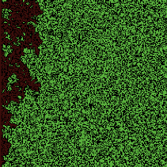
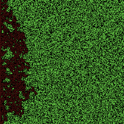
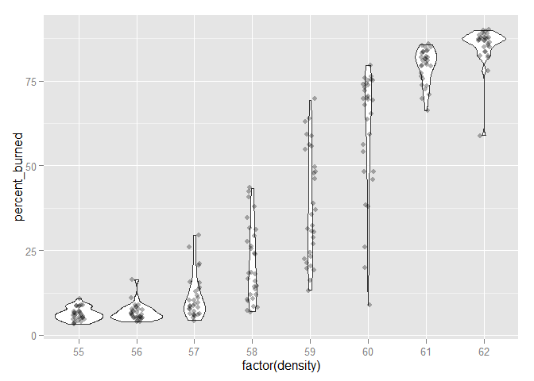
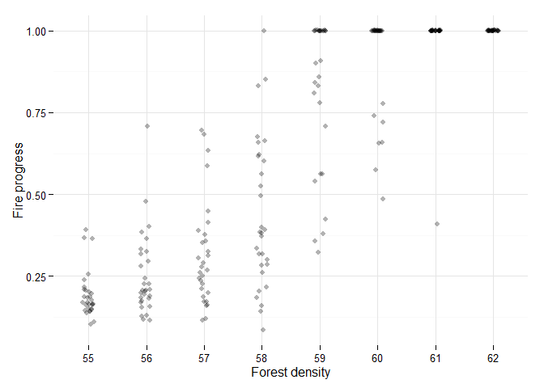

# nlexperiment
Define and run controlled NetLogo experiments
  analogous to NetLogo BehaviorSpace.

## Installation

```r
library(devtools)
install_github("bergant/finstr")
```


## Simple experiment with fire
Create NetLogo experiment object

```r
library(nlexperiment)
# Set the path to your NetLogo instalation
nl_netlogo_path("c:/Program Files (x86)/NetLogo 5.1.0/") 
# Fire model is included in NetLogo sample models:
fire_model <- file.path(nl_netlogo_path(), "models/Sample Models/Earth Science/Fire.nlogo")

# Create simple NetLogo experiment object
experiment <- nl_experiment(
  model_file = fire_model, 
  while_condition = "any? turtles",
  repetitions = 3,
  export_view = TRUE
)
```

Run the experiment:

```r
result <- nl_run(experiment)
#> Warning: No parameter space defined. Using default parameters
```

Find exported view image files paths in `result$export` or just display them by calling `nl_show_view` function:

```r
nl_show_view(result)
```

   


## Observations per each simulation step
Create NetLogo experiment object with step measure defined:

```r
experiment <- nl_experiment(
  model_file = fire_model, 
  while_condition = "any? turtles",
  repetitions = 3,
  step_measures = measures(
    percent_burned = "(burned-trees / initial-trees) * 100"
  )
)
```

Run the experiment:

```r
result <- nl_run(experiment)
#> Warning: No parameter space defined. Using default parameters
```

Observe how fire advances in time for different model runs:

```r
library(ggplot2)

ggplot(result$step, mapping = aes(x = tick, y=percent_burned) ) + 
  geom_point(size = 0.5) +
  facet_grid(. ~ run_id)
```

 

Note that `run_id` and `tick` values are included in the `results$step` by default.


## Observations per each simulation run
Create NetLogo experiment object with defined *run* measure (percent burned)
and parameter values - parameter density goes from 55 to 62.

```r
experiment <- nl_experiment(
  model_file = fire_model, 
  while_condition = "any? turtles",
  repetitions = 30,
  run_measures = measures(
    percent_burned = "(burned-trees / initial-trees) * 100",
    progress = "max [pxcor] of patches with [pcolor > 0 and pcolor < 55]"
  ),
  param_values = list(
    density = seq(from = 55, to = 62, by = 1)
  )
)
```

Run the experiment:

```r
result <- nl_run(experiment, parallel = TRUE)
# Join observations with parameter space values:
dat <- nl_get_run_result(result, add_parameters = TRUE)
```

Plot the results - percent burned as a function of density:

```r
library(ggplot2)
# plot percent burned by density
ggplot(dat, mapping = aes(x = factor(density), y = percent_burned) ) + 
  geom_violin() +
  geom_jitter(position = position_jitter(width = .1), alpha = 0.3) 
```

 

Fire progress from left (-125) to right (125) as a function of density:

```r
ggplot(dat, mapping = aes(x = factor(density), y = progress) ) + 
  geom_jitter(position = position_jitter(width = .1), alpha = 0.3)  +
  theme_minimal()
```

 


