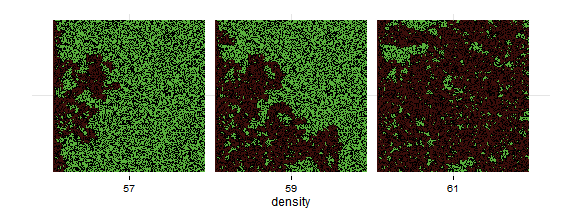
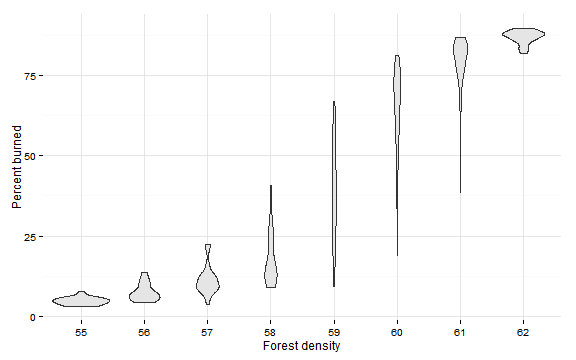
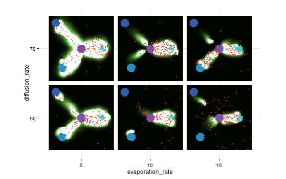
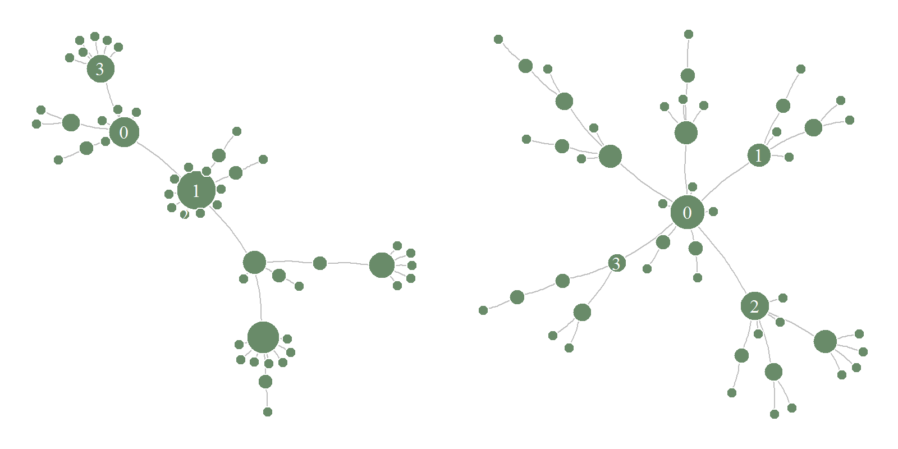
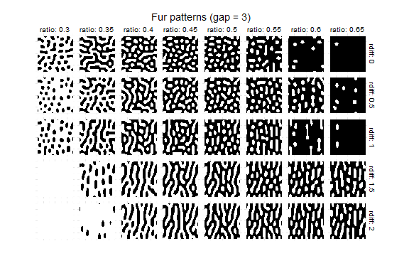
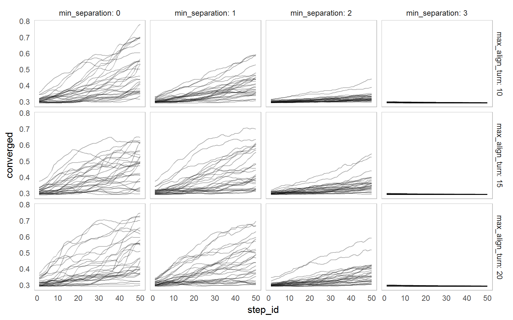
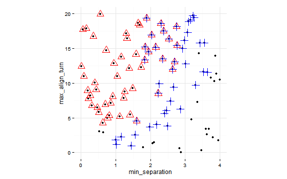
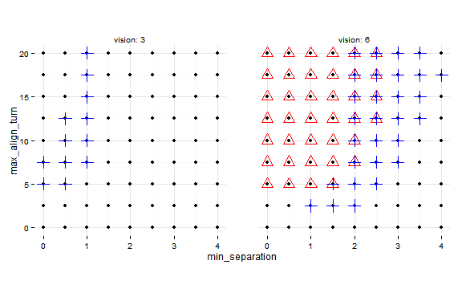
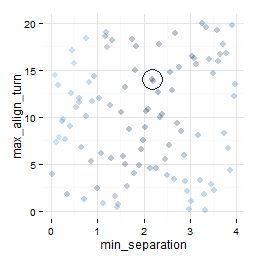
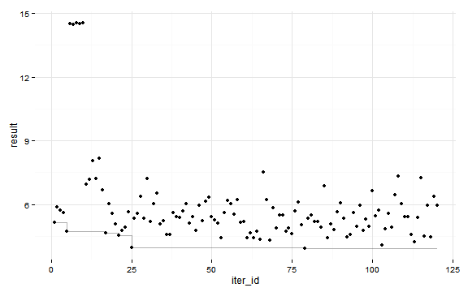

```{r ch_opt, child="include/chunk_options.rmd", cache=FALSE}
```

## Getting Started


* [Fire Experiment](Fire.html) demonstrates 
simple experiment definition, 
exporting views as images, 
definition of temporal and "run" measures.


<aside>
[](fire.html)
[](fire.html)
[](ants.html)
</aside>

* [Agents and Patches](agents.html) example demonstrates how collect variables from
agents and patches. Specifically:
    + reading turtles and their links to recreate network as __igraph__ object
    + reading patches' colors and create a raster image


[](agents.html)
<asideclose>
</asideclose>


* [Ants](ants.html) example demonstrates simple parameter sets 
definition and parameter mapping.


## Parameter Sets

* [Fur Patterns](fur.html) demonstrates 
explicit definition of parameter sets and 
parameter mapping when parameter space is transformed. 

[](fur.html)

* [Flocking Example](flocking.html) shows simple measure definition and observation in parameter space. It is the first in a series of parameter space exploration of the Flocking model.

<aside>
  [](flocking.html)
  [](flocking_sampling.html)
</aside>

* [Categorical Criteria](flocking_categorical.html) and 
[Hyper Latinc Cube Sampling](flocking_sampling) examples
demontrate how to explore parameter space with categorical 
criteria and sampling methods.

[](flocking_categorical.html)

## Optimization

* [Best-fit Criterion](flocking_bestfit.html) shows how to define 
  single criterion evaluation expression 
  and evaluate parameter space with full-factor design.
<aside>
[](flocking_bestfit.html)
</aside>

* [Random Search](flocking_random.html) demonstrate searching for optimal parameters
  using random search.
  
[](flocking_random.html)

* [L-BFGS-B Optimization](flocking_bfgs.html) shows how to use
  optimization functions from other R packages.
  
<aside>
[](flocking_bfgs.html)
</aside>
  
