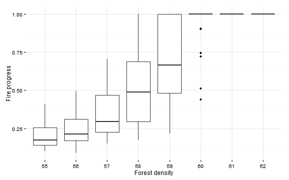
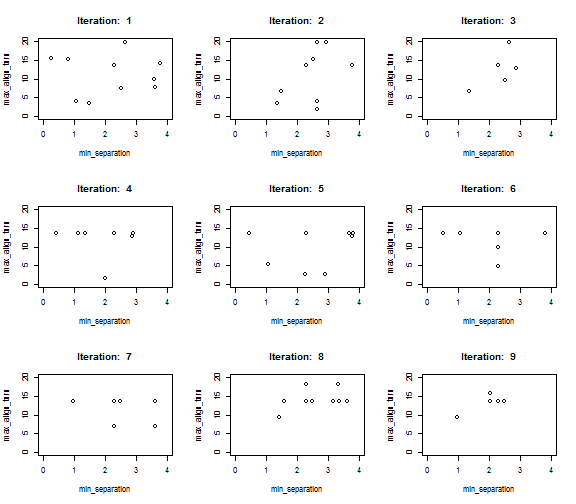

## Getting Started
To learn how to define and run experiments take a quick tour through the 
following examples.

[Fire Experiment](fire.html) example demonstrates 
simple experiment definition with parameters and measures. 

<aside>

</aside>

<!---->

[Agents and Patches](agents.html) example demonstrates how to collect values from
individual agents and patches. Specifically:

* reading turtles and their links to recreate network as __igraph__ object
* reading patches' colors and create a raster image

<asideclose>
</asideclose>

[Ants](ants.html) example demonstrates simple parameter sets 
definition and parameter mapping.

<asideclose>

</asideclose>

## Parameter Sets
Exploring parameter space with full factorial design and sampling methods.

[Fur Patterns](fur.html) demonstrates 
explicit definition of parameter sets and 
parameter mapping when parameter space is transformed. 

[Flocking Example](flocking.html) shows simple measure definition and observation in parameter space. It is the first in a series of parameter space exploration of the Flocking model.

<aside>
  
  
</aside>

[Categorical Criteria](flocking_categorical.html) and 
[Hyper Latinc Cube Sampling](flocking_sampling.html) examples
demontrate how to explore parameter space with categorical 
criteria and sampling methods.
  

## Optimization
Parameter fitting with best-fit criterion 
and optimization methods.

* [Best-fit Criterion](flocking_bestfit.html) shows how to define 
  single criterion evaluation expression 
  and evaluate parameter space with full-factor design.
<aside>

</aside>

* [Random Search](flocking_random_search.html) demonstrate searching for optimal parameters
  using random search.

* [L-BFGS-B Optimization](flocking_bfgs.html) shows how to use
  standard optimization functions.

* [Nelder-Mead Optimization](flocking_nm.html) shows how to use
  optimization functions from other R packages.

* [Simulated Annealing](flocking_sa.html) demonstrates optimization
  with simulated annealing.

* [Genetic Algorithm](flocking_ga.html) demonstrates optimization
  with genetic algorithm.

<aside>
</aside>

