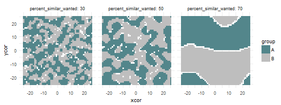
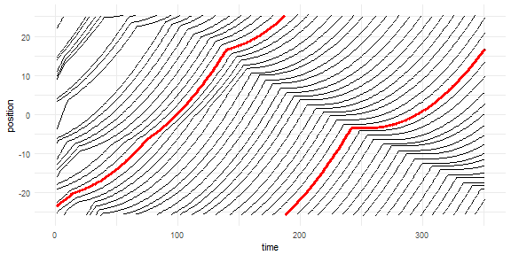
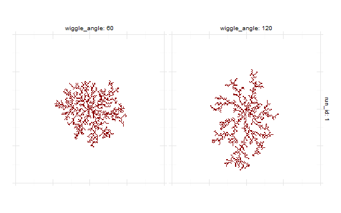

## Getting Started

### Measures

[Fire Experiment](fire.html) example demonstrates
how to setup nlexperiment session, 
define and run experiments, export view images,
define temporal and final run measures, 
get and visualize observations.

<aside>

</aside>

### Agents: Turtles, Links and Patches

[Segregation](segregation.html) example demonstrates how to obtain data from 
individual NetLogo agents.

[Network](network.html) example demonstrates how to collect values from
 turtles and their links to recreate network as __igraph__ object

[Traffic](traffic.html) example demonstrates how to collect values from
 turtles per each time step.

[DLA](dla.html) example demonstrates how to read NetLogo patches.

### Mapping Variables

[Ants](ants.html) example demonstrates simple parameter sets 
definition and mapping.

<asideclose>

</asideclose>

## Parameter Sets

[Fur Patterns](fur.html) demonstrates 
explicit definition of parameter sets and 
parameter mapping when parameter space is transformed. 

[Flocking Example](flocking.html) shows simple measure definition and observation in parameter space. It is the first in a series of parameter space exploration of the Flocking model.

<aside>
  
  
  
</aside>

[Categorical Criteria](flocking_categorical.html) and 
[Hyper Latin Cube Sampling](flocking_sampling.html) examples
demontrate how to explore parameter space with categorical 
criteria and sampling methods.

## Optimization
Parameter fitting with best-fit criterion 
and optimization methods.

* [Best-fit Criterion](flocking_bestfit.html) shows how to define 
  single criterion evaluation expression 
  and evaluate parameter space with factorial design.
<aside>

</aside>

* [Random Search](flocking_random_search.html) demonstrate searching for optimal parameters
  using random search.

* [L-BFGS-B Optimization](flocking_bfgs.html) shows how to use
  standard optimization functions.

* [Nelder-Mead Optimization](flocking_nm.html) shows how to use
  optimization functions from other R packages.

* [Simulated Annealing](flocking_sa.html) demonstrates optimization
  with simulated annealing.

* [Genetic Algorithm](flocking_ga.html) demonstrates optimization
  with genetic algorithm.

<aside>
</aside>

